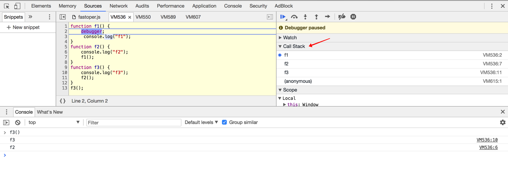
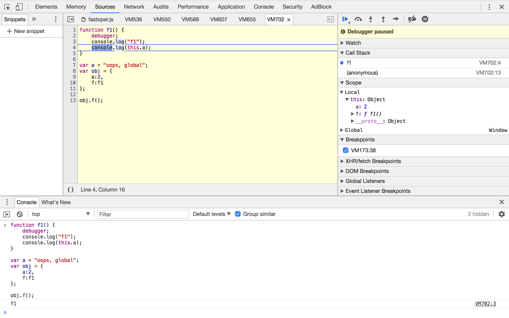

# 调用位置

> 每个函数的 `this` 是在调用时被绑定的。`this` 引用哪个对象完全取决于函数的调用位置（Context）。

调用位置：是函数被调用的位置而不是声明的位置。（可以通过函数调用栈看到）

## 调用栈

```js
function f1() {
	debugger;
     console.log("f1");
}
function f2() {
	console.log("f2");
    f1();
}
function f3() {
    console.log("f3");
    f2();
}
f3();
```



`f3()` 中调用了 `f2()` ，同样 `f2()` 中调用了 `f1()`，换句话说3要执行得先执行2，2要执行得先执行1，因此最终的执行顺序是1，2，3。

从编译器的高度看，先执行3，发现条件不够，于是把3的执行context压入栈中。

执行2条件还不够，于是把2的context也压入栈中（在3上面）。

执行f1的时候，f1的执行上下文就是f2的环境。

## this 引用的对象取决于调用环境的上下文

注意：本例只是先让你第一次真正体会到 `this` 怎么取值的，但由于JS本身设计问题，很多情况下会出现反直觉的引用，其实这是因为有更多其他的原因起到了作用。

```js
function f1() {
	debugger;
	console.log("f1");
	console.log(this.a);//this怎么解读？ 打印出调用位置的a内容
}
var a = "oops, global";
var obj = {
	a:2,
	f:f1
};
obj.f();//2
```

想象interpretor从line1 一直往下解释执行：

- line 1~5, this 都指向了 global，当时在全局上下文中执行操作，当然此处仅仅是声明变量；
- line 6 同上
- line 7 同上
- line 8，先进入 obj 这个对象上下文，再执行 f1方法，此时 栈中的f1依赖的环境是 obj的内容
- 于是 f1 中的 this.a 取出的是在 obj 对象环境中的 a，即 obj.a 为2（而不是 global.a）



（切记，你突然发现好像窥得一丝真谛，其实你只是看到了冰山一角。但是，此刻你正式入门JavaScript了。）