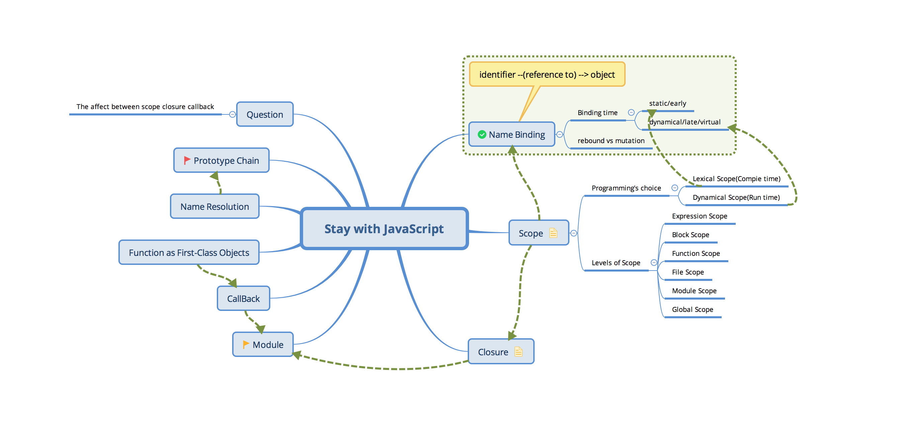

# Stay-with-JS
Give you the truly understand of JavaScript. See more in my [Stay-with Serious ].

Contact us:

## Contents

- PART I: Core Concepts in JavaScript 
  - 1.About this Book (201811)  
  - 2.Brief History of JavaScript (201811)  
  - 3.Quick Start (201811)  
    - Chrome V8 Engine 
    - Crack Your Account 
    - Charles 
  - 4.Basic Compiler Principal (201807) 
  - 5.Core Concepts (201806) 
    - 5.1 Name Binding 
    - 5.2 Scope 
      - Lexical Scope 
      - Dynamic Scope 
    - 5.3 Closure 
    - 5.4 Function as First-Class Objects 
    - 5.5 Call Back 
    - 5.6 this
    - 5.7 Prototype
      - 5.7.1 Call-Site
    - 5.8 Module 
  - 6.ES6 (201808) 
  - 7.Bast Practice (201811)  
    - Functional Programming 
    - jQuery with Chain 
  - 8.Working with Browser (201807) 
    - DOM 
    - HTML5&CSS3 
- PART II: Master in JavaScript Eoosystem 

  - Master in jQuery (201807)  

  - Master in Vue.js (201808)  
  - Master in Node.js (201809)  
  - Master in WeChart Mini-Programs (201810)  
- PART III: Case in Action (201812)  
- PART IV: Recommond and Bravo Questions (201811)  