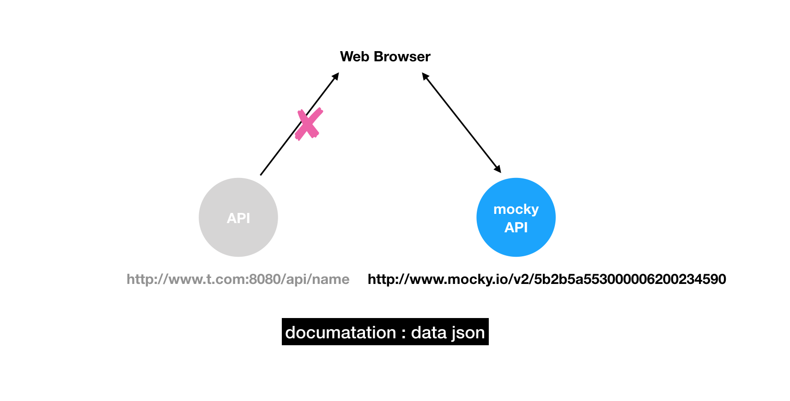

# Test HTTP API

We relay on API to get or modify data in current age since we separate server code from web project programming. What would you do if your backend partner is not ready to deploy the API for you.

We can go really far with decoupling like coding base on documentation.

With the definition of data format (such as how to request and what kind of JSON will response). We can easyly create an a proxy to replace the server API. 

